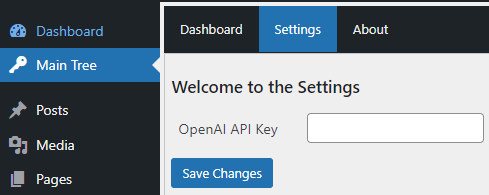

# MainTree

[](https://github.com/Reterics/main-tree/actions/workflows/webpack.yml)

React based general purpose plugin for Wordpress.


## Getting Started

Use your own package manager to install and test locally with the **start** npm command.

```bash
npm install
npm run build
```

Copy the installation in your wordpress /wp-content/plugins/ directory and open the Wordpress plugins page:


After activation you can open the plugin directly from the left sidebar menu.

### Development Notes

[main-tree.php](main-tree.php) is the entry PHP file that initializes the plugin and make sure every asset is loaded.

The entry file for the root React component is [/assets/src/admin.tsx](assets%2Fsrc%2Fadmin.tsx)


## Contribute

There are many ways to [contribute](https://github.com/Reterics/main-tree/blob/main/CONTRIBUTING.md) to Main Tree.
* [Submit bugs](https://github.com/Reterics/main-tree/issues) and help us verify fixes as they are checked in.
* Review the [source code changes](https://github.com/Reterics/main-tree/pulls).
* [Contribute bug fixes](https://github.com/Reterics/main-tree/blob/main/CONTRIBUTING.md).

